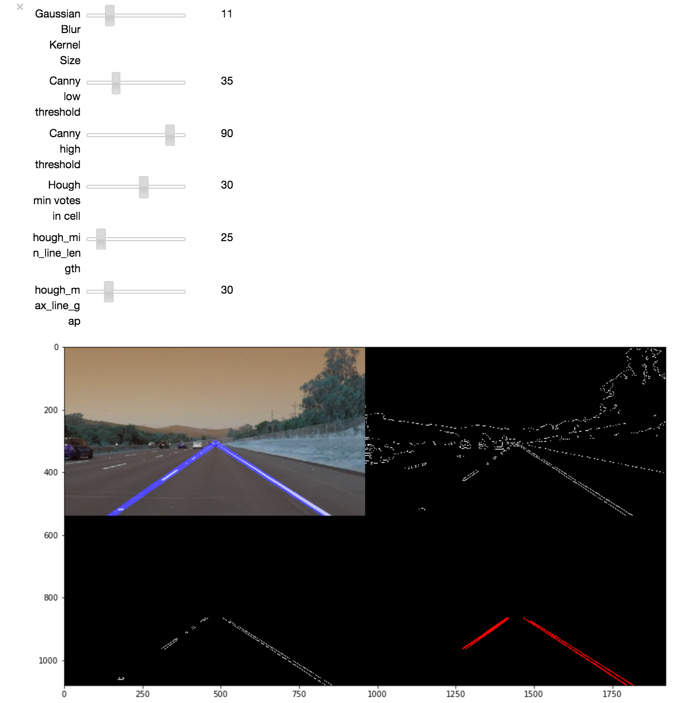

# **Finding Lane Lines on the Road**

## Writeup Template

---

**Finding Lane Lines on the Road**

The goals / steps of this project are the following:
* Make a pipeline that finds lane lines on the road
* Reflect on your work in a written report

---

### Reflection

### 1. Describe your pipeline. As part of the description, explain how you modified the draw_lines() function.

The pipeline consists of 5 steps.

  1. Perform a Gaussian blur (a kernel size of 11-15 pixels works best). This
     helps increase the robustness of the subsequent edge detection, reducing
     the number of spurious edges significantly.
  2. Extract Canny edges (using 35 and 90 for the thresholds works well).
  3. Extract the ROI approximately covering the road in front of the car. This
     is performed *after* the Canny edge detection in order to avoid generating
     unwanted edges at the border of the ROI.
  4. Use the Hough transform algorithm to extract line equations from the Canny
     edges detected in front of the car. In order for a segment to be
     considered legitimate, 30 votes in its Hough cell are required.
  5. `draw_lines()` is called, converting the raw line segments computed in the
     previous step to the full left and right lane markers. This function was
     heavily modified from the original template, and consists of the following
     steps:
        1. Partition the raw line segments into two bins, one for the left lane
        and one for the right one, based on the expected slopes of the given
        lines. They are +30 degrees for the right lane, and -35 degrees for the
        left one. The function allows for quite a bit of variance around those
        values, for robustness, but still discards clear outliers.
        2. For the left and right sides separately, RANSAC is used to fit
        a "mother-line" to the multiple separate segments. The Python package
        `scikit-learn` has been used for this. The choice of RANSAC is
        motivated by the algorithm's robustness to outliers, which may creep up
        due to, e.g., shadows on the road, or other cars.
        3. After the two main line equations are obtained, they are rendered
        onto a copy of the input frame.

No thresholding was used, as it proved to decrease the overall accuracy of the
solution, especially in the final, challenging, sequence.

In order to easily explore various parameter configurations, I leveraged
Jupyter's interactive widgets. I added UI controls to allow instant feedback
for tweaking the blur kernel size, the canny thresholds, and many other
parameters. The resulting interface can be seen in the following figure:

### 2. Identify potential shortcomings with your current pipeline

There are still many situations in which this situation could fail. For
example, it will fail if the lane markings are very eroded or generally
difficult to see. It will also fail while the car is switching lanes, and in
intersections.

Another shortcoming is the inability of the system to use cues other than the
lane markings for lane detection, which could be very helpful on unmarked
or very busy roads.

The system is also very likely to fail under extreme lighting conditions, such
as in tunnels, at night, or during rain/snowstorms.

### 3. Suggest possible improvements to your pipeline

A good direction for improving the system is to leverage other cues from the
road to perform lane estimation, including other cars. Instinctively, this is
what humans do themselves on unmarked or poorly marked roads.

Further testing on longer sequences, including tunnels, urban areas, heavy
traffic, etc., could help identify failure conditions of the pipeline, together
with novel ways of addressing these problems.

In the long run, deep learning-based approaches have shown the greatest amount
of potential in lane detection, with their ability of learning from huge data
sets. Implicitly, they are capable of learning many things mentioned in the
previous paragraphs, such as interpreting other cars' positions when
determining the current lane, looking at other markings and vegetation, etc.

